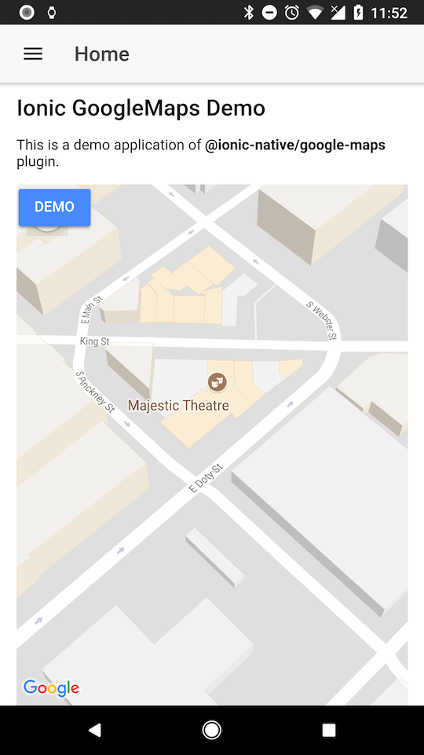

# GoogleMaps quick demo

This is a demo app of [@ionic-native/google-maps](https://www.npmjs.com/package/@ionic-native/google-maps) plugin and [Cordova GoogleMaps](https://github.com/mapsplugin/cordova-plugin-googlemaps) plugin.

## Demo apk (Android)
[ionic-googlemaps-quickdemo.apk](./ionic-googlemaps-quickdemo.apk)

## Replace with your api key

You need to replace `(REPLACE WITH YOUR APK KEY)` in config.xml and package.json files with your Google Maps API keys.
